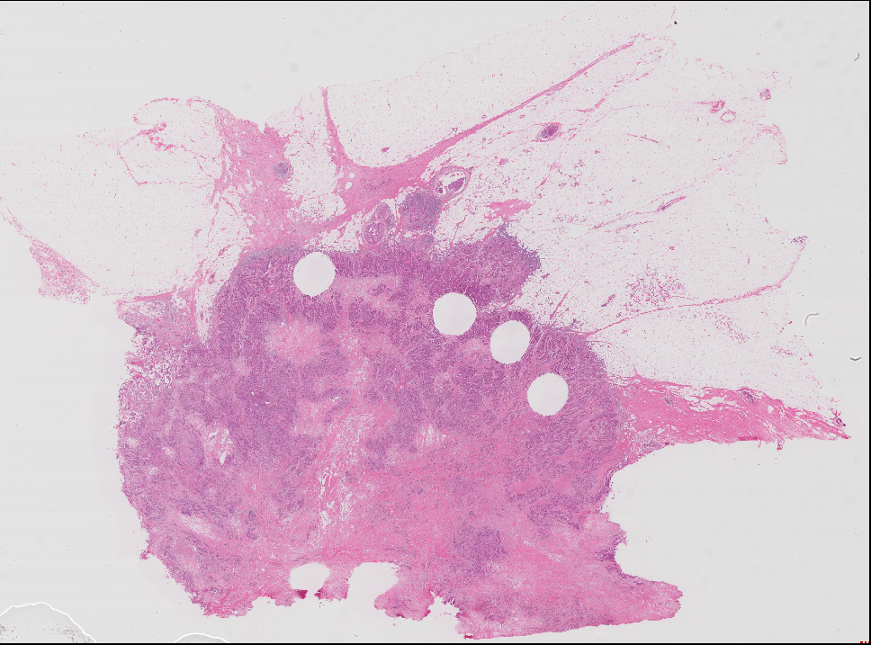
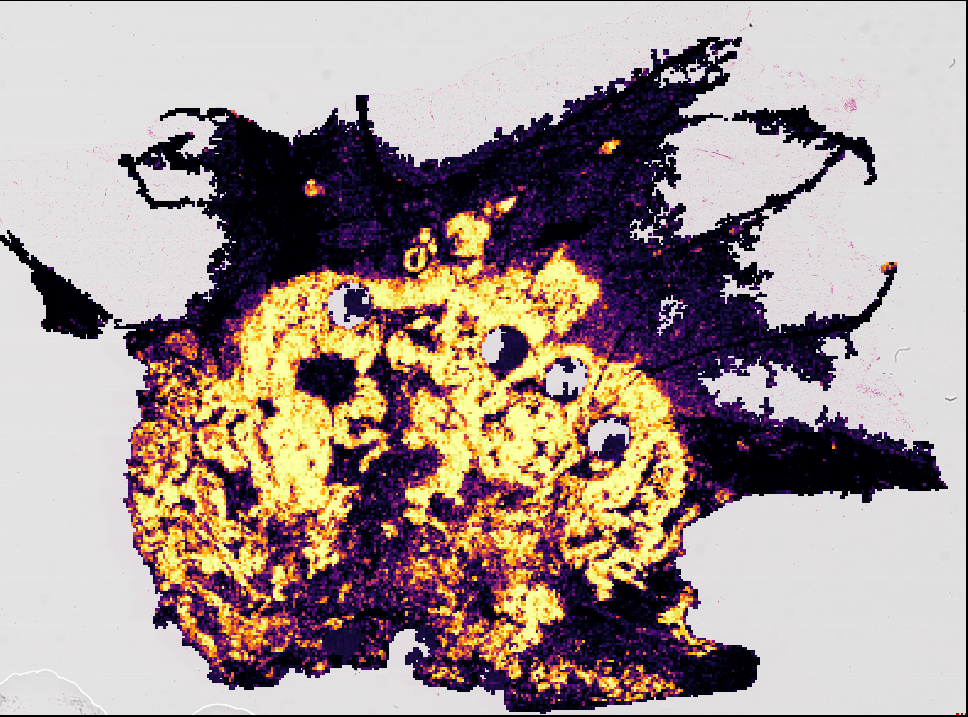

# Patch classification pipelines for computational pathology

Original H&E                        |  Heatmap of Tumor Probability
:----------------------------------:|:-----------------------------------:
  | 

🔥 🚀 Blazingly fast pipeline to run patch-based classification models on whole slide images.

# Installation

Use the Docker / Singularity / Apptainer image, which includes all of the dependencies and scripts.

Alternatively, install from GitHub. You will also have to install `torch` and
`torchvision` (please see [the PyTorch documentation](https://pytorch.org/get-started/locally/)).
We do not install these dependencies automatically because their installation can vary based
on a user's system.

```
python -m pip install \
    --find-links https://girder.github.io/large_image_wheels \
    git+https://github.com/kaczmarj/patch-classification-pipeline.git

```

TODO: download models.

## Developers

Clone this GitHub repository and install the package (in editable mode with the `dev` extras).

```
git clone https://github.com/kaczmarj/patch-classification-pipeline.git
cd patch-classification-pipeline
python -m pip install --editable .[dev] --find-links https://girder.github.io/large_image_wheels
```

# Example

Here we demonstrate running this pipeline on a sample image. Before going through this,
please install the package.

## Setup directories and data

We make a new directory to store this example, including data and results. Enter the
following commands into a terminal. This will download a sample whole slide image
(170 MB). For this example, we only use one whole slide image, but you can apply this
pipeline to an arbitrary number of whole slide images &mdash; simply put them all in the
same directory.

```
mkdir -p example-wsi-inference
cd example-wsi-inference
mkdir -p sample-images
cd sample-images
wget -nc https://openslide.cs.cmu.edu/download/openslide-testdata/Aperio/CMU-1.svs
cd ..
```

## On "bare metal" (not inside a container)

Run the pipeline (without a container). This will apply the pipeline to all of the
images in `sample-images/` (only 1 in this example) and will write results to
`results/`. We set `CUDA_VISIBLE_DEVICES=0` to use the first GPU listed in
`nvidia-smi`. If you do not have a GPU, model inference can take about 20 minutes.
(The patch spacing is == 88 um / 350 pixels.)

TODO: download model weights.

```
CUDA_VISIBLE_DEVICES=0 wsi_run \
    --wsi_dir sample-images/ \
    --results_dir results/ \
    --patch_size 350 \
    --um_px 0.25142857142 \
    --model resnet34 \
    --num_classes 2 \
    --weights resnet34-brca.pt \
    --num_workers 8 \
    --classes notumor,tumor
```

## Run in an Apptainer container (formerly Singularity)

TODO: download container.

```
CUDA_VISIBLE_DEVICES=0 singularity run \
    --nv \
    --bind $(pwd) \
    --bind /data10:/data10:ro \
    cancer-detection_latest.sif \
        --wsi_dir brca-samples/ \
        --results_dir results \
        --patch_size 350 \
        --um_px 0.25142857142 \
        --model resnet34 \
        --num_classes 2 \
        --weights weights/resnet34-brca.pt \
        --num_workers 8
```

## Run in a Docker container

This requires the program `nvidia-container-runtime-hook`. Please see the
[Docker documentation](https://docs.docker.com/config/containers/resource_constraints/#gpu)
for more information. If you do not have a GPU installed, you can use CPU by removing
`--gpus all` from the command below.

We use `--user $(id -u):$(id -g)` to run the container as a non-root user (as ourself).
This way, the output files are owned by us. Without specifying this option, the output
files would be owned by the root user.

When mounting data, keep in mind that the workdir in the Docker container is `/work`
(one can override this with `--workdir`). Relative paths must be relative to the workdir.

Note: using `--num_workers > 0` will require a `--shm-size > 256mb`. If the shm size is
too low, a "bus error" will be thrown.

```
docker run --rm -it \
    --shm-size 512m \
    --gpus all \
    --user $(id -u):$(id -g) \
    --mount type=bind,source=$(pwd),target=/work/ \
    kaczmarj/patch-classification-pipeline \
        --wsi_dir sample-images/ \
        --results_dir results/ \
        --patch_size 350 \
        --um_px 0.25142857142 \
        --model resnet34 \
        --num_classes 2 \
        --weights weights/resnet34-brca.pt \
        --num_workers 2 \
        --classes notumor,tumor
```

## Output

This will create the following directory structure

```
results/
├── masks
├── model-outputs
├── patches
└── stitches
```

- masks contains PNGs of tissue masks
- model-outputs contains CSVs of model outputs
- patches contains HDF5 files of patch coordinates
- stitches contains PNGs with patches stitched together

## Convert to GeoJSON (for QuPath and other viewers)

```
wsi_convert_csv_to_geojson results/model-outputs/TCGA-foobar.csv TCGA-foobar.json
```


# Convert original models to newer PyTorch format

The original models were made with PyTorch 0.4.0 and [Torchvision 0.2.0](https://github.com/pytorch/vision/tree/v0.2.0). We are using them with PyTorch > 1.0 so we re-save them.

## InceptionV4

The `inceptionv4` module was copied from [pretrainedmodels](https://github.com/Cadene/pretrained-models.pytorch/blob/8aae3d8f1135b6b13fed79c1d431e3449fdbf6e0/pretrainedmodels/models/inceptionv4.py) and then the model was loaded.

```python
import torch
model_path = "brca_models_cnn/inceptionv4_cancer_350px_lr_1e-2_decay_5_jitter_val6slides_harder_pretrained_none_0423_0449_0.8854108440469536_11.t7"
orig_model = torch.load(model_path, map_location="cpu")
state_dict = orig_model["model"].module.state_dict()
torch.save(state_dict, "inceptionv4-new.pt")
```

## ResNet34

```python
import torch
model_path = "brca_models_cnn/RESNET_34_cancer_350px_lr_1e-2_decay_5_jitter_val6slides_harder_pretrained_none_1117_0044_0.8715164676076728_17.t7"
orig_model = torch.load(model_path, map_location="cpu")
state_dict = orig_model["model"].module.state_dict()
keys_missing = ["bn1.num_batches_tracked", "layer1.0.bn1.num_batches_tracked", "layer1.0.bn2.num_batches_tracked", "layer1.1.bn1.num_batches_tracked", "layer1.1.bn2.num_batches_tracked", "layer1.2.bn1.num_batches_tracked", "layer1.2.bn2.num_batches_tracked", "layer2.0.bn1.num_batches_tracked", "layer2.0.bn2.num_batches_tracked", "layer2.0.downsample.1.num_batches_tracked", "layer2.1.bn1.num_batches_tracked", "layer2.1.bn2.num_batches_tracked", "layer2.2.bn1.num_batches_tracked", "layer2.2.bn2.num_batches_tracked", "layer2.3.bn1.num_batches_tracked", "layer2.3.bn2.num_batches_tracked", "layer3.0.bn1.num_batches_tracked", "layer3.0.bn2.num_batches_tracked", "layer3.0.downsample.1.num_batches_tracked", "layer3.1.bn1.num_batches_tracked", "layer3.1.bn2.num_batches_tracked", "layer3.2.bn1.num_batches_tracked", "layer3.2.bn2.num_batches_tracked", "layer3.3.bn1.num_batches_tracked", "layer3.3.bn2.num_batches_tracked", "layer3.4.bn1.num_batches_tracked", "layer3.4.bn2.num_batches_tracked", "layer3.5.bn1.num_batches_tracked", "layer3.5.bn2.num_batches_tracked", "layer4.0.bn1.num_batches_tracked", "layer4.0.bn2.num_batches_tracked", "layer4.0.downsample.1.num_batches_tracked", "layer4.1.bn1.num_batches_tracked", "layer4.1.bn2.num_batches_tracked", "layer4.2.bn1.num_batches_tracked", "layer4.2.bn2.num_batches_tracked"]
for key in keys_missing:
    state_dict[key] = torch.as_tensor(0)
torch.save(state_dict, "resnet34-new.pt")
```

## VGG16

VGG16 was modified for this paper. Please see [Table 3 of the paper](https://www.ncbi.nlm.nih.gov/pmc/articles/PMC7369575/table/tbl3/).

```python
import torch
model_path = "brca_models_cnn/VGG16_cancer_350px_lr_1e-2_decay_5_jitter_val6slides_harder_pretrained_none_0423_0456_0.8766822301565503_11.t7"
orig_model = torch.load(model_path, map_location="cpu")
state_dict = orig_model["model"].module.state_dict()
torch.save(state_dict, "vgg16-modified-new.pt")
```
