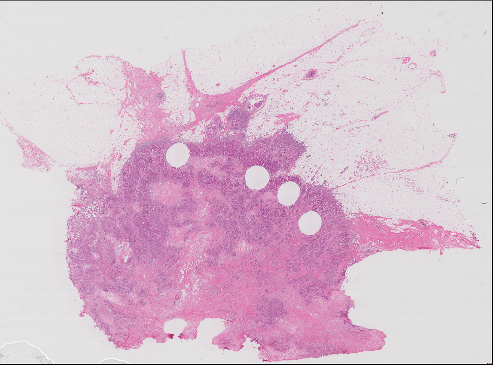
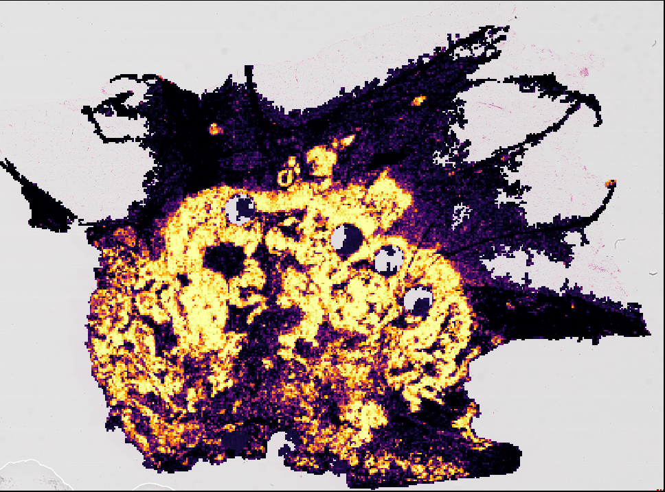

# WSInfer: deep learning inference on whole slide images

Original H&E                        |  Heatmap of Tumor Probability
:----------------------------------:|:-----------------------------------:
  | 

🔥 🚀 Blazingly fast pipeline to run patch-based classification models on whole slide images.

[](https://github.com/kaczmarj/wsinfer/actions/workflows/ci.yml)
[](https://wsinfer.readthedocs.io/en/latest/?badge=latest)
[](https://pypi.org/project/wsinfer/)
[](https://pypi.org/project/wsinfer/)

See https://wsinfer.readthedocs.io for documentation.

# Installation

## Pip

Pip install this package from GitHub. First install `torch` and `torchvision`
(please see [the PyTorch documentation](https://pytorch.org/get-started/locally/)).
We do not install these dependencies automatically because their installation can vary based
on a user's system. Then use the command below to install this package.

```
python -m pip install --find-links https://girder.github.io/large_image_wheels wsinfer
```

To use the _bleeding edge_, use

```
python -m pip install \
    --find-links https://girder.github.io/large_image_wheels \
    git+https://github.com/kaczmarj/wsinfer.git
```

## Developers

Clone this GitHub repository and install the package (in editable mode with the `dev` extras).

```
git clone https://github.com/kaczmarj/wsinfer.git
cd wsinfer
python -m pip install --editable .[dev] --find-links https://girder.github.io/large_image_wheels
```
