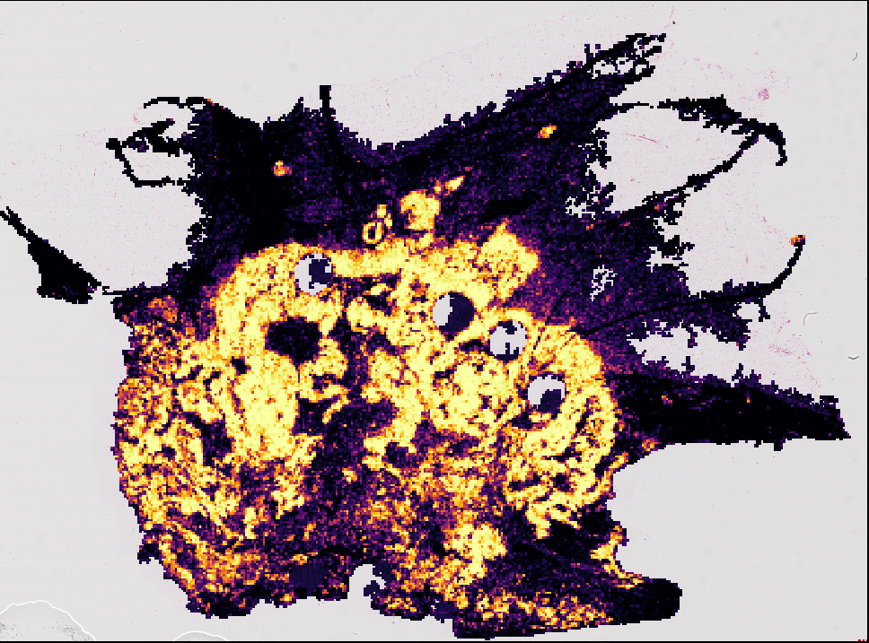

:html_theme.sidebar_secondary.remove:

WSInfer: blazingly fast inference on whole slide images
=======================================================

.. image:: https://github.com/kaczmarj/wsinfer/actions/workflows/ci.yml/badge.svg
   :alt: GitHub workflow status
   :target: https://github.com/kaczmarj/wsinfer/actions/workflows/ci.yml
.. image:: https://readthedocs.org/projects/wsinfer/badge/?version=latest
  :alt: Documentation build status
  :target: https://wsinfer.readthedocs.io/en/latest/?badge=latest
.. image:: https://img.shields.io/pypi/v/wsinfer.svg
  :alt: PyPI version
  :target: https://pypi.org/project/wsinfer/
.. image:: https://img.shields.io/pypi/pyversions/wsinfer
  :alt: Supported Python versions
  :target: https://pypi.org/project/wsinfer/

|

🔥 🚀 **WSInfer** is a blazingly fast pipeline to run patch-based classification models
on whole slide images. It includes several built-in models, and it can be used with any
PyTorch model as well. The built-in models :ref:`are listed below <available-models>`.

.. caution::

  WSInfer is an academic project intended for research use only.

Running inference on whole slide images is done with a single command line:

::

   wsinfer run \
      --wsi-dir slides/ \
      --results-dir results/ \
      --model breast-tumor-resnet34.tcga-brca

See all of the available trained models with ::

    wsinfer-zoo ls

To get started, please :ref:`install WSInfer<installing>` and check out the :ref:`User Guide`.
To get help, report issues or request features, please
`submit a new issue <https://github.com/SBU-BMI/wsinfer/issues/new>`_ on our GitHub
repository. If you would like to make your patch classification model available in WSInfer, please
get in touch with us! You can `submit a new GitHub issue <https://github.com/SBU-BMI/wsinfer/issues/new>`_.

.. admonition:: Citation

  If you find our work useful, please cite our paper https://doi.org/10.1038/s41698-024-00499-9.

  Kaczmarzyk, J.R., O'Callaghan, A., Inglis, F. et al. Open and reusable deep learning for pathology with WSInfer and QuPath. *npj Precis. Onc.* **8**, 9 (2024). https://doi.org/10.1038/s41698-024-00499-9

.. |img-tissue| image:: _static/brca-tissue.png
  :alt: TCGA BRCA sample slide

+----------------+------------------------------+
| Original H&E   | Heatmap of Tumor Probability |
+================+==============================+
| |img-tissue|   | |img-heatmap|                |
+----------------+------------------------------+

.. toctree::
   :maxdepth: 2
   :caption: Contents:

   Installing <installing>
   User Guide <user_guide>
   CLI <cli>
   QuPath Extension <qupath_ext>

.. _available-models:

Available models
----------------

After installing :code:`wsinfer`, use the following command to list the most up-to-date models: ::

    wsinfer-zoo ls

The table below may be incomplete.

.. list-table::
   :header-rows: 1

   * - Classification task
     - Output classes
     - Architecture
     - Dataset
     - Resolution (px @ um/px)
     - Reference
   * - Breast adenocarcinoma detection
     - no-tumor, tumor
     - ResNet34
     - TCGA BRCA
     - 350 @ 0.25
     - `Ref <https://doi.org/10.1016%2Fj.ajpath.2020.03.012>`_
   * - Colorectal tissue classification
     - background, normal_colon_mucosa, debris, colorectal_adenocarcinoma_epithelium, adipose, mucus, smooth_muscle, cancer_associated_stroma, lymphocytes
     - ResNet50 (trained by TIAToolbox dev team)
     - NCT-CRC-HE-100K
     - 224 @ 0.5
     - `Ref <https://doi.org/10.1038/s43856-022-00186-5>`_
   * - Lung adenocarcinoma detection
     - lepidic, benign, acinar, micropapillary, mucinous, solid
     - ResNet34
     - TCGA LUAD
     - 350 @ 0.5
     - `Ref <https://github.com/SBU-BMI/quip_lung_cancer_detection>`_
   * - Lymph node metastasis detection in breast cancer
     - nomets, mets
     - ResNet50 (trained via TIAToolbox dev team)
     - PatchCamelyon
     - 96 @ 1.0
     - `Ref <https://doi.org/10.1038/s43856-022-00186-5>`_
   * - Lymphocyte detection
     - til-negative, til-positive
     - InceptionV4 (without batchnorm)
     - 23 TCGA studies
     - 100 @ 0.5
     - `Ref <https://doi.org/10.3389/fonc.2021.806603>`_
   * - Pancreatic adenocarcinoma detection
     - tumor-positive
     - Preactivation ResNet34
     - TCGA PAAD
     - 350 @ 1.5
     - `Ref <https://doi.org/10.1007/978-3-030-32239-7_60>`_
   * - Prostate adenocarcinoma detection
     - grade3, grade4or5, benign
     - ResNet34
     - TCGA PRAD
     - 175 @ 0.5
     - `Ref <https://github.com/SBU-BMI/quip_prad_cancer_detection>`_

Indices and tables
==================

* :ref:`genindex`
* :ref:`modindex`
* :ref:`search`
